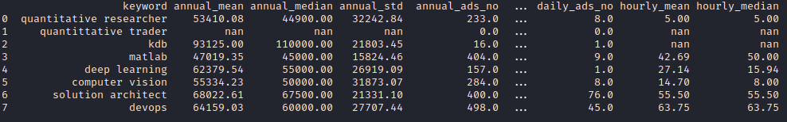

## Update: Currently this code is not working due to the changes on the target website. Indeed uses redirection to enrcypted urls which requires further development in order to scrape.

## Indeed UK job market report

The aim of the repository is to create automatic current job market report based on web-scraping Python script. 
Currently it may have bugs, but in the future it will be fixed and it will show a more comprehensive overview.

Further objectives are as follows:

* add maximum and minimum salary for the given keyword
* add 10th and 90th percentile and show histograms
* monitor the trends by running the script every two weeks, so that we can observe salary levels in a form of time series
* add new keywords as new technologies emerge
* distinguish salary for contracts inside and outside IR35 if possible

The current version produces the output in a console as well as in a csv file.

